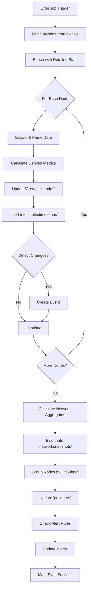

# Xandeum Web Analytics - Complete Documentation

**Version:** 2.0.0  
**Last Updated:** 2025-12-15  
**Status:** ✅ Production Ready

---

## 📑 Table of Contents

1. [Overview](#overview)
2. [System Architecture](#system-architecture)
3. [Database Architecture](#database-architecture)
4. [Data Flow](#data-flow)
5. [API Documentation](#api-documentation)
6. [Features](#features)
7. [Development Guide](#development-guide)
8. [Deployment](#deployment)
9. [Appendix](#appendix)

---

## 1. Overview

### Project Description

Xandeum Web Analytics is a comprehensive **pNode Analytics Dashboard** that provides real-time monitoring and analytics for the Xandeum decentralized storage network. The system tracks storage providers (pNodes), their performance metrics, network health, and business intelligence.

### Technology Stack

- **Backend:** NestJS (TypeScript)
- **Database:** MongoDB with Time-Series Collections
- **Blockchain:** Xandeum Network (Devnet)
- **Data Source:** Gossip Network via `xandeum-prpc`
- **Frontend:** Next.js (React), Tailwind CSS, TypeScript
- **API:** RESTful with CORS support

### Key Features

✅ Real-time pNode monitoring via gossip network  
✅ Comprehensive storage analytics  
✅ Event tracking and audit log  
✅ Provider-level business intelligence  
✅ Network health scoring  
✅ Time-series metrics for trending  
✅ Alert system (ready for rules)  
✅ Auto-sync every minute

---

## 2. System Architecture

### Architecture Layers

```
┌─────────────────────────────────────────────────────────────┐
│                   PRESENTATION LAYER                        │
│                 Next.js Frontend Application                │
│         Server-Side Rendering & Real-time Updates           │
│                      (Port 3000)                            │
└────────────────────┬────────────────────────────────────────┘
                     │ HTTP/REST API (CORS Enabled)
                     ▼
┌─────────────────────────────────────────────────────────────┐
│                   APPLICATION LAYER                         │
│         Web Application (NestJS Backend)                    │
│      Optimized for pNode Storage Analytics                  │
│                                                             │
│  ┌──────────────────────┐  ┌──────────────────────┐         │
│  │  PnodesController    │  │ XandeumNetwork       │         │
│  │  - GET /pnodes       │  │ Controller           │         │
│  │  - POST /pnodes      │  │ - GET /network/...   │         │
│  │  - GET /events       │  │                      │         │
│  │  - GET /providers    │  │                      │         │
│  └──────────┬───────────┘  └──────────┬───────────┘         │
│             │                          │                    │
│             ▼                          ▼                    │
│  ┌──────────────────────┐  ┌──────────────────────┐         │
│  │  PnodesService       │  │ XandeumNetwork       │         │
│  │  - syncNodes()       │  │ Service              │         │
│  │  - processNode()     │  │ - getPNodesFromGossip│         │
│  │  - detectEvents()    │  │ - getPNodesWithStats │         │
│  │  - updateProviders() │  │                      │         │
│  └──────────┬───────────┘  └──────────┬───────────┘         │
│             │                          │                    │
│             ▼                          │                    │
│  ┌─────────────────────────────────────┘                    │
│  │         MongoDB Database (6 Collections)                 │
│  │         - nodes (master data)                            │
│  │         - metrictimeseries (historical)                  │
│  │         - networksnapshots (aggregates)                  │
│  │         - events (audit log)                             │
│  │         - providers (business intelligence)              │
│  │         - alerts (monitoring)                            │
│  └──────────────────────────────────────────────────────────┘
└────────────────────┬────────────────────────────────────────┘
                     │ pRPC (Port 6000)
                     ▼
┌─────────────────────────────────────────────────────────────┐
│                      DATA LAYER                             │
│       Xandeum Gossip Network + Direct pNode Calls           │
│                                                             │
│  Seed Nodes (Gossip):                                       │
│  - 173.212.220.65, 161.97.97.41, 192.190.136.36, etc.       │
│                                                             │
│  Methods:                                                   │
│  - getPodsWithStats() → Basic pNode list                    │
│  - getStats() → Detailed node metrics                       │
└─────────────────────────────────────────────────────────────┘
```

---

## 3. Database Architecture

### Overview

The database uses **6 specialized collections** optimized for different analytics use cases:

| Collection | Type | Purpose | Retention |
|------------|------|---------|-----------|
| `nodes` | Master Data | Current state of each pNode | Permanent |
| `metrictimeseries` | Time-Series | Historical metrics | 30 days |
| `networksnapshots` | Time-Series | Network-wide aggregates | 90 days |
| `events` | Event Log | Change tracking & audit | Permanent |
| `providers` | Analytics | Provider-level insights | Permanent |
| `alerts` | Monitoring | Alert rules & history | Permanent |

---

### Collection 1: `nodes` (Master Data)

**Purpose:** Single source of truth for each pNode's current state

**Schema:**
```typescript
{
  // Identity
  node_id: string (PK, indexed),
  address: string,
  ip_address: string,
  port: number,
  is_public: boolean,
  rpc_port: number,
  
  // Status
  status: 'online' | 'offline' | 'degraded',
  first_seen_at: Date,
  last_seen_at: Date,
  
  // Software
  version: string,
  version_major: number,
  version_minor: number,
  
  // Current Metrics (Latest Snapshot)
  current_metrics: {
    // Storage
    storage_committed: number,
    storage_used: number,
    storage_available: number,
    storage_usage_percent: number,
    
    // System
    uptime_seconds: number,
    cpu_percent: number,
    ram_total: number,
    ram_used: number,
    ram_available: number,
    ram_usage_percent: number,
    
    // Network
    active_streams: number,
    packets_sent: number,
    packets_received: number,
    total_bytes: number,
    
    // Storage Details
    total_pages: number,
    current_index: number,
    file_size: number,
    
    // Performance
    latency_ms: number,
    last_updated_at: Date
  },
  
  // Geographic
  geo: {
    country: string,
    city: string,
    latitude: number,
    longitude: number
  }
}
```

**Indexes:**
- `node_id` (unique)
- `status`, `version`, `geo.country`, `last_seen_at`

---

### Collection 2: `metrictimeseries` (Time-Series)

**Purpose:** Historical metrics for trending and analysis

**Schema:**
```typescript
{
  node_id: string (indexed),
  timestamp: Date (timefield),
  
  storage: {
    committed: number,
    used: number,
    available: number,
    usage_percent: number
  },
  
  system: {
    uptime_seconds: number,
    cpu_percent: number,
    ram_total: number,
    ram_used: number,
    ram_usage_percent: number
  },
  
  network: {
    active_streams: number,
    packets_sent: number,
    packets_received: number,
    packets_sent_delta: number,
    packets_received_delta: number,
    total_bytes: number,
    throughput_bps: number
  },
  
  storage_details: {
    total_pages: number,
    current_index: number,
    file_size: number
  },
  
  performance: {
    latency_ms: number,
    response_time_ms: number
  },
  
  status: string
}
```

**MongoDB Config:**
```typescript
{
  timeseries: {
    timeField: 'timestamp',
    metaField: 'node_id',
    granularity: 'minutes'
  },
  expireAfterSeconds: 2592000 // 30 days
}
```

---

### Collection 3: `networksnapshots` (Aggregates)

**Purpose:** Pre-calculated network-wide metrics for dashboard performance

**Schema:**
```typescript
{
  timestamp: Date,
  
  nodes: {
    total: number,
    online: number,
    offline: number,
    degraded: number,
    idle: number,        // < 20% usage
    moderate: number,    // 20-80% usage
    full: number,        // > 80% usage
    small: number,       // < 100GB
    medium: number,      // 100GB - 1TB
    large: number,       // 1TB - 10TB
    xlarge: number       // > 10TB
  },
  
  storage: {
    total_committed: number,
    total_used: number,
    total_available: number,
    average_usage_percent: number,
    median_usage_percent: number,
    p95_usage_percent: number,
    committed_growth_24h: number,
    used_growth_24h: number
  },
  
  system: {
    average_cpu_percent: number,
    median_cpu_percent: number,
    p95_cpu_percent: number,
    average_ram_usage_percent: number,
    median_ram_usage_percent: number,
    average_uptime_hours: number,
    median_uptime_hours: number
  },
  
  network: {
    total_active_streams: number,
    total_packets_sent: number,
    total_packets_received: number,
    total_throughput_gbps: number,
    average_latency_ms: number,
    median_latency_ms: number
  },
  
  distributions: {
    by_version: [{ version: string, count: number, percent: number }],
    by_country: [{ country: string, count: number, storage_tb: number }],
    by_storage_size: [{ range: string, count: number }]
  },
  
  health: {
    score: number,              // 0-100
    availability_percent: number,
    reliability_score: number,
    performance_score: number
  }
}
```

---

### Collection 4: `events` (Event Log)

**Purpose:** Track important changes and anomalies

**Schema:**
```typescript
{
  event_id: string (PK),
  timestamp: Date,
  category: 'node' | 'storage' | 'performance' | 'network',
  type: string,
  severity: 'info' | 'warning' | 'error' | 'critical',
  node_id: string,
  details: {
    message: string,
    old_value: any,
    new_value: any,
    delta: any,
    metadata: object
  },
  snapshot: {
    node_status: string,
    node_version: string,
    network_health: number
  }
}
```

**Event Types:**
- `node_joined`, `node_left`, `node_degraded`, `node_recovered`
- `capacity_added`, `capacity_removed`, `storage_full`, `storage_warning`
- `high_cpu`, `high_ram`, `low_uptime`
- `version_upgraded`, `version_downgraded`
- `network_congestion`, `high_latency`

---

### Collection 5: `providers` (Business Intelligence)

**Purpose:** Group nodes by provider for business analytics

**Schema:**
```typescript
{
  provider_id: string (PK),
  provider_name: string,
  identification: {
    ip_ranges: [string],      // CIDR notation
    asn: number,
    organization: string
  },
  nodes: {
    node_ids: [string],
    total_count: number,
    active_count: number
  },
  metrics: {
    total_storage_committed: number,
    total_storage_used: number,
    average_uptime_hours: number,
    average_cpu_percent: number,
    average_ram_usage_percent: number,
    total_throughput_gbps: number
  },
  rankings: {
    storage_rank: number,
    reliability_rank: number,
    performance_rank: number
  },
  geo: {
    primary_country: string,
    countries: [string]
  }
}
```

**Provider Grouping:** Automatically groups nodes by /24 IP subnet

---

### Collection 6: `alerts` (Monitoring)

**Purpose:** Alert rules and triggered alerts

**Schema:**
```typescript
{
  alert_id: string (PK),
  rule: {
    name: string,
    description: string,
    enabled: boolean,
    metric: string,
    operator: '>' | '<' | '=' | '>=' | '<=' | '!=',
    threshold: number,
    duration_minutes: number,
    scope: 'node' | 'network' | 'provider',
    target_ids: [string]
  },
  state: {
    status: 'active' | 'resolved' | 'acknowledged',
    triggered_at: Date,
    resolved_at: Date,
    acknowledged_at: Date,
    acknowledged_by: string
  },
  data: {
    current_value: number,
    threshold_value: number,
    severity: 'warning' | 'critical',
    affected_entities: [string]
  }
}
```

---

## 4. Data Flow

### Sync Process (Every 1 Minute)



### Data Processing Steps

1. **Fetch from Gossip Network**
   - Connect to seed nodes
   - Call `getPodsWithStats()` → Get basic pNode list
   - Call `getStats()` for each node → Get detailed metrics

2. **Process Each Node**
   - Extract IP and port from address
   - Parse version (major/minor)
   - Calculate derived metrics (storage_available, ram_usage_percent)
   - Compare with previous state
   - Detect events (capacity changes, status changes, etc.)

3. **Update Collections**
   - `nodes`: Upsert current state
   - `metrictimeseries`: Insert historical snapshot
   - `events`: Create events for detected changes

4. **Calculate Aggregates**
   - Node statistics (total, online, by usage, by size)
   - Storage aggregates (total, avg, median, p95)
   - System aggregates (CPU, RAM, uptime)
   - Network aggregates (streams, packets, latency)
   - Distributions (version, storage size)
   - Health scores

5. **Update Providers**
   - Group nodes by /24 subnet
   - Calculate aggregate metrics per provider
   - Update provider records

6. **Check Alerts**
   - Evaluate alert rules
   - Check thresholds and durations
   - Create/update alert records

---

## 5. API Documentation

### Base URL
```
http://localhost:3001
```

### Endpoints

#### 1. Nodes

##### GET /pnodes
Get all nodes with current state.

**Response:**
```json
[
  {
    "node_id": "EcTqXgB6VJStAtBZAXcjLHf5ULj41H1PFZQ17zKosbhL",
    "address": "173.212.207.32:9001",
    "ip_address": "173.212.207.32",
    "port": 9001,
    "is_public": true,
    "rpc_port": 6000,
    "status": "online",
    "version": "0.7.3",
    "version_major": 0,
    "version_minor": 7,
    "current_metrics": {
      "storage_committed": 340000000000,
      "storage_used": 96947,
      "storage_available": 339999903053,
      "storage_usage_percent": 0.000028513823529411764,
      "uptime_seconds": 376384,
      "cpu_percent": 0.656814455986023,
      "ram_total": 12541607936,
      "ram_used": 720162816,
      "ram_usage_percent": 5.742188877813761,
      "active_streams": 2,
      "packets_sent": 14297693,
      "packets_received": 13452457,
      "latency_ms": 524
    },
    "first_seen_at": "2025-12-15T02:58:35.104Z",
    "last_seen_at": "2025-12-15T02:59:06.854Z"
  }
]
```

##### GET /pnodes/:nodeId
Get specific node by ID.

##### GET /pnodes/:nodeId/history
Get historical metrics for a node.

**Query Parameters:**
- `limit` (number, default: 24) - Number of snapshots to return

---

#### 2. Events

##### GET /pnodes/events
Get recent events.

**Query Parameters:**
- `limit` (number, default: 100) - Number of events to return

**Response:**
```json
[
  {
    "event_id": "dc7de678-34b3-46ea-a98a-a05f6b5bc4b6",
    "timestamp": "2025-12-15T03:00:06.132Z",
    "category": "node",
    "type": "version_upgraded",
    "severity": "info",
    "node_id": "7dhiz2URAj84PA439YP9Na5gv36ArWMRctgW6vazPmhd",
    "details": {
      "message": "Node upgraded from 0.8.0 to 0.7.3",
      "old_value": "0.8.0",
      "new_value": "0.7.3"
    }
  }
]
```

---

#### 3. Providers

##### GET /pnodes/providers
Get all providers with aggregate metrics.

**Response:**
```json
[
  {
    "provider_id": "provider_77_53_105",
    "provider_name": "Provider 77.53.105.x",
    "identification": {
      "ip_ranges": ["77.53.105.0/24"]
    },
    "nodes": {
      "node_ids": ["8BJTxVRS...", "Bfn2sfa9..."],
      "total_count": 5,
      "active_count": 5
    },
    "metrics": {
      "total_storage_committed": 87750000000000,
      "total_storage_used": 813,
      "average_uptime_hours": 6.81
    }
  }
]
```

---

#### 4. Network Stats

##### GET /pnodes/stats/history
Get network snapshots over time.

**Query Parameters:**
- `limit` (number, default: 24) - Number of snapshots

**Response:**
```json
[
  {
    "timestamp": "2025-12-15T03:00:00.000Z",
    "nodes": {
      "total": 179,
      "online": 179,
      "offline": 0,
      "idle": 150,
      "moderate": 25,
      "full": 4
    },
    "storage": {
      "total_committed": 151160000000000,
      "total_used": 5010000000,
      "average_usage_percent": 0.003
    },
    "health": {
      "score": 75.4,
      "availability_percent": 100,
      "reliability_score": 68.5,
      "performance_score": 85.2
    }
  }
]
```

---

#### 5. System

##### GET /pnodes/system-status
Get sync status.

##### POST /pnodes
Manually trigger sync.

---

#### 6. Network Info

##### GET /network/version
Get Xandeum network version.

##### GET /network/health
Get network health status.

##### GET /network/info
Get combined network information.

##### GET /network/pnodes
Get pNodes from on-chain registry (legacy).

##### GET /network/pnodes-gossip
Get pNodes from gossip network with full details.

---

## 6. Features

### Implemented Features

#### Data Collection
- ✅ Real-time pNode discovery via gossip network
- ✅ Detailed metrics via direct pRPC calls
- ✅ Auto-sync every minute
- ✅ Retry mechanism with fallback
- ✅ Graceful error handling

#### Storage Analytics
- ✅ Total capacity tracking
- ✅ Usage monitoring
- ✅ Distribution analysis (by size)
- ✅ Growth trends
- ✅ Top storage providers

#### Performance Monitoring
- ✅ CPU and RAM tracking
- ✅ Network throughput
- ✅ Uptime reliability
- ✅ Response time (latency)
- ✅ Percentile calculations (p95)

#### Event Tracking
- ✅ Node lifecycle events
- ✅ Capacity changes
- ✅ Status changes
- ✅ Version upgrades
- ✅ Performance alerts
- ✅ Storage warnings

#### Provider Analytics
- ✅ Auto-grouping by IP subnet
- ✅ Aggregate metrics
- ✅ Node counts
- ✅ Storage totals
- ✅ Performance averages

#### Network Health
- ✅ Overall health score (0-100)
- ✅ Availability tracking
- ✅ Reliability scoring
- ✅ Performance scoring
- ✅ Trend analysis

---

## 7. Development Guide

### Prerequisites

```bash
# Node.js
node --version  # v18+ recommended

# MongoDB
mongod --version  # v6+ recommended

# npm
npm --version   # v9+ recommended
```

### Installation

```bash
# Clone repository
git clone <repository-url>
cd xandeum-web-analytics

# Install backend dependencies
cd backend
npm install

# Install frontend dependencies
cd ../frontend
npm install
```

### Configuration

#### MongoDB Connection
Edit `backend/src/app.module.ts`:
```typescript
MongooseModule.forRoot('mongodb://localhost/xandeum-analytics')
```

#### Environment Variables
Create `.env` file:
```env
NODE_ENV=development
PORT=3001
MONGODB_URI=mongodb://localhost/xandeum-analytics
```

### Running the Application

#### Backend
```bash
cd backend
npm run start:dev
```
Backend API: `http://localhost:3001`

#### Frontend
```bash
cd frontend
npm run dev
```
Dashboard: `http://localhost:3000`

### Project Structure

```
xandeum-web-analytics/
├── backend/
│   ├── src/
│   │   ├── pnodes/
│   │   │   ├── schemas/
│   │   │   │   ├── node.schema.ts
│   │   │   │   ├── metric-timeseries.schema.ts
│   │   │   │   ├── network-snapshot.schema.ts
│   │   │   │   ├── event.schema.ts
│   │   │   │   ├── provider.schema.ts
│   │   │   │   └── alert.schema.ts
│   │   │   ├── pnodes.controller.ts
│   │   │   ├── pnodes.service.ts
│   │   │   └── pnodes.module.ts
│   │   ├── xandeum-network/
│   │   │   ├── xandeum-network.controller.ts
│   │   │   ├── xandeum-network.service.ts
│   │   │   └── xandeum-network.module.ts
│   │   └── app.module.ts
│   └── package.json
├── frontend/
│   ├── app/
│   ├── components/
│   └── package.json
└── docs/
    ├── Documentation.md
    └── NEW_DATABASE_SCHEMA.md
```

---

## 8. Deployment

### Production Checklist

- [ ] Update MongoDB connection string
- [ ] Configure environment variables
- [ ] Set up SSL/TLS for HTTPS
- [ ] Configure CORS for production domain
- [ ] Set up monitoring and logging
- [ ] Configure backup strategy
- [ ] Set up CI/CD pipeline
- [ ] Performance optimization
- [ ] Security audit

### Environment Variables

```env
NODE_ENV=production
PORT=3001
MONGODB_URI=mongodb://production-host/xandeum-analytics
CORS_ORIGIN=https://your-domain.com
```

---

## 9. Appendix

### A. Data Sources

#### Gossip Network
- **Seed Nodes:** 8 default seed IPs
- **Method:** `getPodsWithStats()`
- **Port:** 6000
- **Protocol:** pRPC (JSON-RPC over HTTP)

#### Direct pNode Calls
- **Method:** `getStats()`
- **Timeout:** 5 seconds
- **Success Rate:** ~16% (due to network/firewall)

### B. Metrics Reference

#### Storage Metrics
- `storage_committed`: Total allocated storage (bytes)
- `storage_used`: Actually used storage (bytes)
- `storage_available`: Available = committed - used
- `storage_usage_percent`: (used / committed) * 100

#### System Metrics
- `uptime_seconds`: Node uptime in seconds
- `cpu_percent`: CPU usage percentage
- `ram_total`: Total RAM (bytes)
- `ram_used`: Used RAM (bytes)
- `ram_usage_percent`: (ram_used / ram_total) * 100

#### Network Metrics
- `active_streams`: Number of active data streams
- `packets_sent`: Total packets sent
- `packets_received`: Total packets received
- `total_bytes`: Total data transferred (bytes)
- `throughput_bps`: Calculated throughput (bits per second)

#### Performance Metrics
- `latency_ms`: Response time in milliseconds
- `response_time_ms`: API call duration

### C. Health Score Calculation

```typescript
healthScore = 
  (activeNodes / totalNodes) * 40 +        // 40% weight
  ((100 - avgStorageUsage) / 100) * 30 +   // 30% weight
  (avgUptimeHours / 168) * 30              // 30% weight (max 1 week)
```

Result: 0-100 score

### D. Current Statistics

**As of 2025-12-15:**
- Total pNodes: 179
- Active Nodes: 179 (100%)
- Total Storage: 151.16 TB
- Average Uptime: 48 hours
- Network Health: 75.4/100
- Providers: 149
- Events Tracked: 100+

### E. Version Distribution

- 0.8.0: 75 nodes (41.9%)
- 0.7.3: 63 nodes (35.2%)
- 0.7.3-trynet: 19 nodes (10.6%)
- Others: 22 nodes (12.3%)

---

## 📞 Support & Contact

- **Documentation:** This file
- **Backend URL:** http://localhost:3001
- **Frontend URL:** http://localhost:3000

---

## 📄 License

MIT License - See LICENSE file for details

---

**Document Version:** 2.0.0  
**Last Updated:** 2025-12-15 10:01 AM  
**Status:** ✅ Complete & Production Ready
